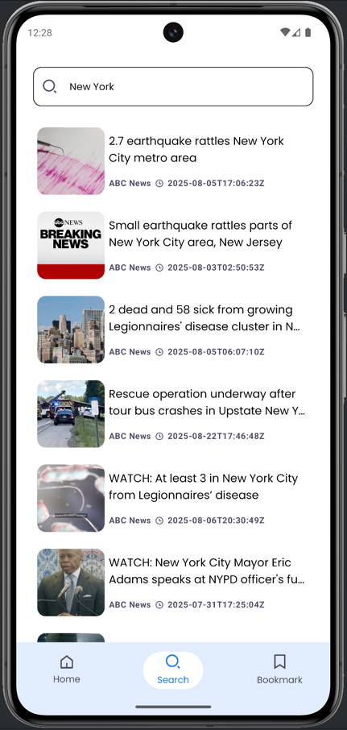
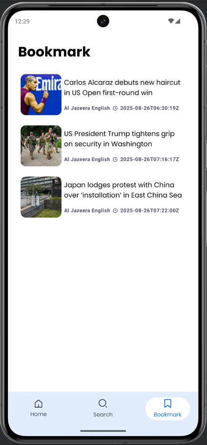

# Jetpack-NewsApp

**Jetpack-NewsApp** is an Android application built with [Jetpack Compose](https://developer.android.com/jetpack/compose) that provides users with the latest news from various sources.

## 📱 Features

- Browse a list of news articles with short descriptions.
- Intuitive and responsive user interface.
- Filter news by categories.
- Support for light and dark themes.

## ⚙️ Technologies

- **Programming Language**: Kotlin
- **UI**: Jetpack Compose
- **Architecture**: MVVM
- **Libraries**: Retrofit (networking), Room (local database), Coil (image loading)

## 🏊️ Data Source

This app fetches news data from the **NewsAPI**. To use the app, you need to get your own API key:

1. Go to [https://newsapi.org/](https://newsapi.org/) and sign up for a free account.
2. Generate an API key.
3. Replace the `YOUR_API_KEY` placeholder in the project with your API key (usually in a `Constants.kt` or `BuildConfig` file).

Example:

```kotlin
const val NEWS_API_KEY = "YOUR_API_KEY"
```

> Without a valid API key, the app will not be able to fetch live news data.

## 🚀 Installation

1. Clone the repository:

```bash
git clone https://github.com/mammetmyrat/Jetpack-NewsApp.git
```

2. Open the project in Android Studio.
3. Sync the project with Gradle.
4. Add your NewsAPI key as described above.
5. Run the app on an emulator or physical device.

## 📸 Screenshots

| Main                                        | Detail                                   | Search                                   | Bookmark                                     |
|-----------------------------------------------|------------------------------------------|------------------------------------------|----------------------------------------------|
|  |  |  |  |

## 🛠️ Contributing

If you want to contribute:

1. Fork the repository.
2. Create a new branch (`git checkout -b feature/your-feature`).
3. Make your changes and commit them (`git commit -am 'Add new feature'`).
4. Push to your fork (`git push origin feature/your-feature`).
5. Create a Pull Request.

## 🗓 License

This project is licensed under the MIT License. See the [LICENSE](LICENSE) file for details.

---

### MIT License Template

```text
MIT License

Copyright (c) 2025 Mammet Mammetmyrat

Permission is hereby granted, free of charge, to any person obtaining a copy
of this software and associated documentation files (the "Software"), to deal
in the Software without restriction, including without limitation the rights
to use, copy, modify, merge, publish, distribute, sublicense, and/or sell
copies of the Software, and to permit persons to whom the Software is
furnished to do so, subject to the following conditions:

The above copyright notice and this permission notice shall be included in all
copies or substantial portions of the Software.

THE SOFTWARE IS PROVIDED "AS IS", WITHOUT WARRANTY OF ANY KIND, EXPRESS OR
IMPLIED, INCLUDING BUT NOT LIMITED TO THE WARRANTIES OF MERCHANTABILITY,
FITNESS FOR A PARTICULAR PURPOSE AND NONINFRINGEMENT. IN NO EVENT SHALL THE
AUTHORS OR COPYRIGHT HOLDERS BE LIABLE FOR ANY CLAIM, DAMAGES OR OTHER
LIABILITY, WHETHER IN AN ACTION OF CONTRACT, TORT OR OTHERWISE, ARISING FROM,
OUT OF OR IN CONNECTION WITH THE SOFTWARE OR THE USE OR OTHER DEALINGS IN THE
SOFTWARE.
```

